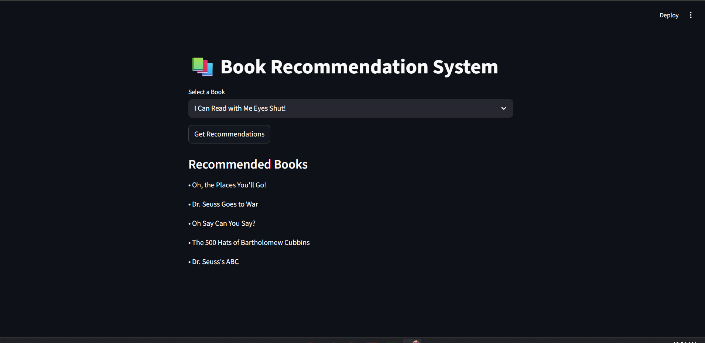

# 📚 Book Recommendation System

A **content-based Book Recommendation System** built using **Python, Pandas, scikit-learn, and Streamlit**.  
The system recommends books based on textual similarity using **TF-IDF Vectorization** and **Cosine Similarity**.

<!-- ---

## 🚀 Live Demo (Render)
👉 https://book-recommender.onrender.com  

--- -->

## 📂 GitHub Repository
👉 https://github.com/ash-iiiiish/Book-Recommendation-System 

---

## 📊 Dataset

- **Source:** Kaggle  
- **Link:** https://www.kaggle.com/datasets/dylanjcastillo/7k-books-with-metadata  

---

## 🧠 Project Workflow

### PART 1 — Data Preprocessing
- Load dataset using Pandas
- Inspect shape, columns, and sample rows
- Combine text fields:
  - title
  - authors
  - categories
  - description
- Clean text:
  - Lowercasing
  - Removing punctuation & special characters
  - Removing stopwords
  - Handling missing values

---

### PART 2 — Text Vectorization
- Used **TF-IDF Vectorizer**
- Parameters:
  - `max_features = 5000`
  - `ngram_range = (1, 2)`
- Converted cleaned text into numerical vectors

---

### PART 3 — Similarity Computation
- Computed **Cosine Similarity** between all books
- Cosine similarity is ideal for:
  - High-dimensional sparse text data
  - Measuring semantic similarity independent of text length

---

### PART 4 — Recommendation Logic
- Implemented a recommendation function:
```python
def recommend(item_name, top_n=5):
    # returns top N similar books
```
- Steps:
  - Identify selected book index
  - Compute similarity scores
  - Sort and return top N recommendations

---

### PART 5 — Streamlit Web App
- Simple UI with:
  - Dropdown to select a book
  - Button to generate recommendations
- Displays top recommended books clearly

---

## 🖥️ App Screenshot



---

## 📁 Project Structure
```
book-recommender/
│
├── app.py
├── books.csv
├── requirements.txt
├── README.md
└── images/
    └── image.png
```

---

## ⚙️ Installation & Local Setup

### 1️⃣ Clone Repository
```bash
git clone https://github.com/your-username/book-recommender.git
cd book-recommender
```

### 2️⃣ Install Dependencies
```bash
pip install -r requirements.txt
```

### 3️⃣ Run Streamlit App
```bash
streamlit run app.py
```

---

## ☁️ Deployment (Render)

- Environment: **Python 3**
- Build Command:
```bash
pip install -r requirements.txt
```
- Start Command:
```bash
streamlit run app.py --server.port $PORT --server.address 0.0.0.0
```

---

## ✅ Technologies Used
- Python
- Pandas
- scikit-learn
- Streamlit

---

## 🎯 Final Notes
- Model development and experimentation were performed in a **Jupyter Notebook**
- Final application logic implemented using **Streamlit (`app.py`)**
- Deployed successfully on **Render**

---


## 👨‍💻 Contributors
- [@ash-iiiiish](https://github.com/ash-iiiiish)

## License
This project is licensed under the MIT License. Feel free to use, modify, and distribute.


⭐ If you like this project, feel free to star the repository!